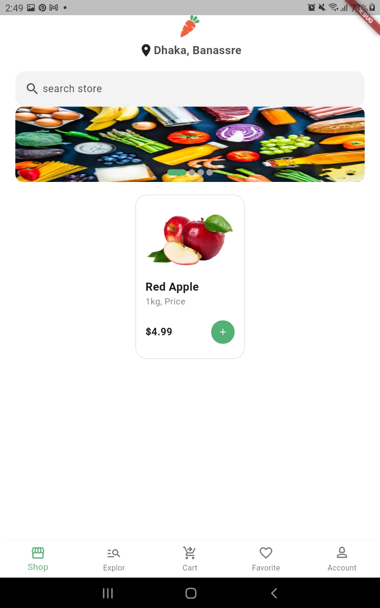
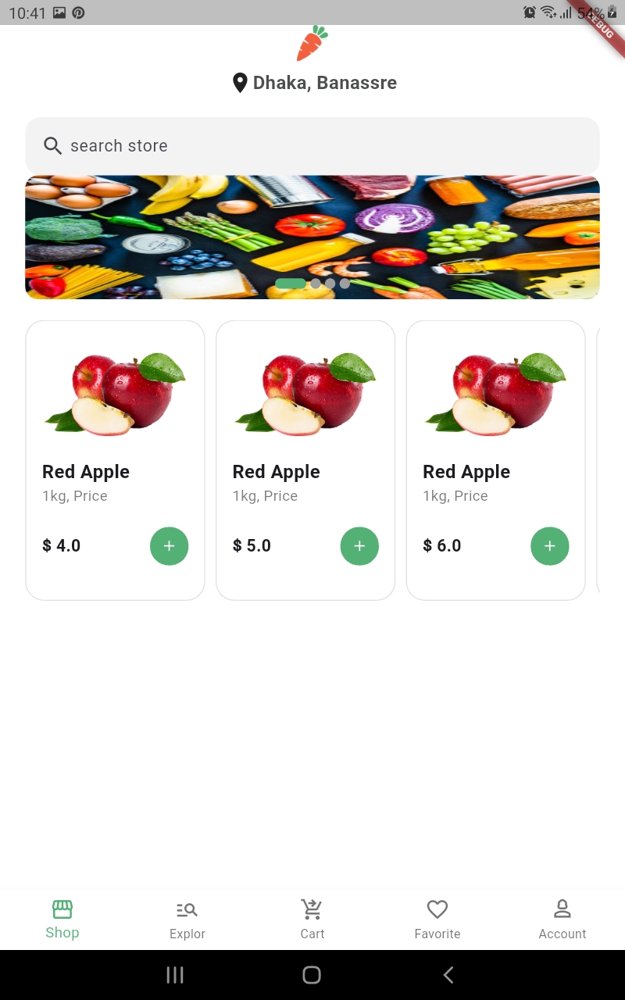

#  Grocery App

تطبيق تسوق بقالة (Grocery App) مبني باستخدام **Flutter**، بيسمح للمستخدم يتصفح المنتجات، يبحث عنها، ويضيفها للسلة بسهولة وبتصميم بسيط ونظيف.

---

## (Features)

- 🏠 **شاشة رئيسية (Home)** تعرض:
  - Slider تلقائي (Carousel) لعروض المنتجات مع Page Indicator متحرك
  - قائمة منتجات (Cards) بصورة، اسم، سعر، وزرار إضافة للسلة
- 🔍 **بحث عن المنتجات** عبر شريط بحث مخصص (Search Store)
- 📍 عرض الموقع الحالي للتوصيل أعلى الشاشة
- 🧭 شريط تنقل سفلي (Bottom Navigation) يحتوي على:
  - Shop
  - Explore
  - Cart
  - Favorite
  - Account

---

## 📱 سكرين شوتس (Screenshots)

---

## 🛠️ التقنيات المستخدمة (Tech Stack)

- **Flutter** (Dart)
- [carousel_slider](https://pub.dev/packages/carousel_slider) — لعرض الـ Slider الرئيسي
- [smooth_page_indicator](https://pub.dev/packages/smooth_page_indicator) — لعرض نقاط الـ Slider (Page Indicator)

